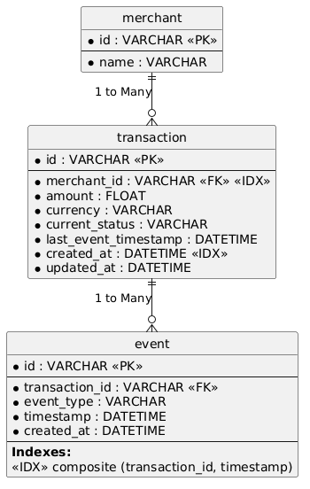

# setu-assignment

Please find the Postman collection [here](./docs/Setu.postman_collection.json)

## Instructions to run

### To run locally using docker compose, execute below command in your terminal

  ```docker compose up -d```

Once the services are up, if you want to pre-seed data, use the ```scripts/seed.py``` as below:

  ```docker compose exec app python -m scripts.seed```

## Data model



main tables required:
 - transaction 
 - event 
 - merchant 

indexes:
 - single index on merchant_id and created_at in Transaction table to support 
   summaries endpoint
 - composite index on (transaction_id and timestamp) in Event table to support 
   discrepancies query

## Assumptions and Design decisions
 
 - Merchant entity is owned by its own separate backend service
 - API for creation for merchants are out of scope for this assignment
 - add a seeding script to add few merchants as needed (merchant_[1-5])
 - Compare timestamps instead of strictly checking state transitions upon incoming
   events to validate it (for eg, a payment_processed event could get lost and a settled event could be the next one arriving)
 - Use row level locking to avoid race conditions when updating transaction state
 - will hard code secrets in pydantic settings and docker compose for convenient testing
 
## Trade offs
 
  * Chose single indexes on merchant_id and created_at in Transaction table instead
    of a composite index on these columns as it would degrade write performance,
    search entire table when filterd by a single column, and since all these filters could be individually or used combined, Postgres's index combination feature can be relied on 

  * Will keep the current_status on the transaction table even though it's derivable
    from the event table, since it will lead to better read performance

## AI usage

Gemini Pro was used like a pair programmer for discussing and overall syntax help

## Improvements needed

- better tests
- better request validations
- proper error handling


  